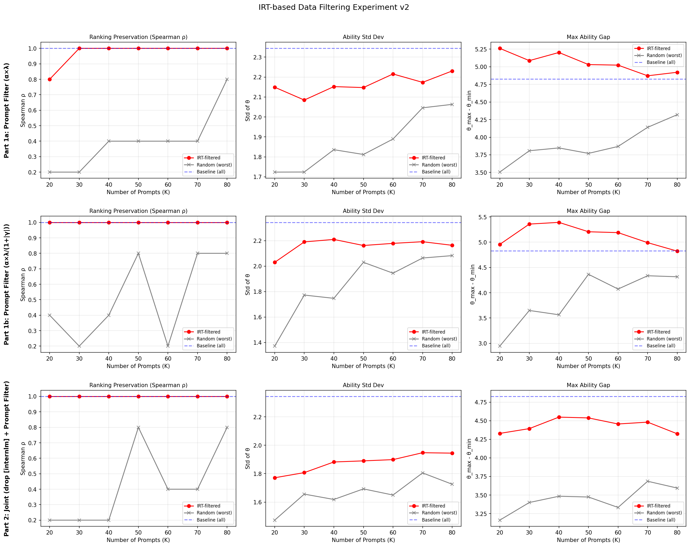

# 组会周报：基于 Pairwise IRT 的 LLM 评测数据筛选实验

## 一、研究动机

在 LLM-as-a-Judge 范式下，我们用多个小模型（judge）对待评测模型的回答做成对比较。但并非所有评测题目（prompt）和评审者（judge/rater）都同等有效——有些题目区分不了模型好坏，有些 judge 打分接近随机。

核心问题：**能否利用 IRT（项目反应理论）估计出的参数，自动筛选出高质量的 prompt 和 rater，用更少的数据达到甚至超过全量数据的评测效果？**

---

## 二、实验 Pipeline 总览

```
Step 0: select_prompts.py               →  从 Chatbot Arena 原始数据筛选 200 条高质量 prompt
Step 1: run_rollout.py                  →  4 个待评测模型对 200 道 prompt 生成回答
Step 2: run_judge.py                    →  3 个 judge 模型对所有模型配对做成对比较
Step 3: run_filter_experiment_v2.py     →  拟合 IRT 模型 + 利用 IRT 参数做筛选实验
```

---

## 三、各阶段详细说明

### Step 0: 评测题目筛选（select_prompts.py）

**数据来源：** LMSYS Chatbot Arena 对话数据集（33,000 条人类评测记录）

**筛选条件：**
1. 英文、单轮对话
2. prompt 长度 20-500 字符（太短无信息量，太长模型截断）
3. 涉及 4 个目标模型之间的直接对比
4. 有明确胜负（排除 tie）
5. 排除有害/敏感内容（利用 OpenAI moderation 和 toxic_chat_tag 字段）
6. 按 prompt 文本去重
7. 按长度分桶采样，保证题目类型多样性

**输出文件：** `irt_experiment_prompts_200.json`，200 条 prompt，每条附带人类评测的胜负记录。

---

### Step 1: 模型回答生成（run_rollout.py）

**待评测模型（4 个，均为 13B 级别）：**

| 模型名 | 本地路径 |
|--------|---------|
| vicuna-13b | vicuna-13b-v1.3 |
| wizardlm-13b | WizardLM-13B-V1.2 |
| koala-13b | koala-13B-HF |
| alpaca-13b | alpaca-13b |

**推理方式：** 使用 vLLM 加速推理，每个模型套用各自的对话模板（Vicuna/WizardLM 用 `USER:/ASSISTANT:` 格式，Alpaca 用 `### Instruction/### Response` 格式，Koala 用 `BEGINNING OF CONVERSATION` 格式）。

**输出文件：** 每个模型一个 JSON 文件，存于 `Rollout/` 目录（如 `Rollout/vicuna-13b_responses.json`）。

---

### Step 2: LLM-as-a-Judge 成对比较（run_judge.py）

**Judge 模型（3 个 7B 级别小模型）：**

| Judge 名 | 模型 | 对应 IRT 中的角色 |
|----------|------|------------------|
| qwen | Qwen2.5-7B-Instruct | Rater 1 |
| mistral | Mistral-7B-Instruct-v0.3 | Rater 2 |
| internlm | InternLM2.5-7B-Chat | Rater 3 |

**比较方式：** 对 4 个模型的所有两两配对（C(4,2)=6 对），每道 prompt、每个 judge 都做一次比较，judge 输出 "A" 或 "B" 表示哪个回答更好。

**数据量：** 200 prompt × 6 模型对 × 3 judge = 3600 条比较记录

**输出文件：** `judge_results.json`，每条记录包含 `model_a, model_b, outcome, judge, prompt_id`。

---

### Step 3: Pairwise IRT 模型拟合与筛选实验（run_filter_experiment_v2.py）

本步骤内部完成 IRT 拟合和筛选实验，无需单独运行 `run_irt.py`。

#### 3.1 模型公式

$$P(A > B \mid r, p) = \lambda_p \cdot \sigma\!\Big(\alpha_r \cdot \alpha_p \cdot (\theta_A - \theta_B) - \beta_r - \gamma_p\Big) + \frac{1 - \lambda_p}{2}$$

其中 $\sigma(\cdot)$ 为 sigmoid 函数。

#### 3.2 参数说明与对应关系

| 符号 | 名称 | 维度 | 含义 | 先验分布 |
|------|------|------|------|---------|
| $\theta_i$ | Model Ability | 每个待评测模型 1 个（共 4 个） | 模型的综合能力值，越高越强 | $\mathcal{N}(0, 1)$ |
| $\alpha_r$ | Rater Discriminability | 每个 judge 1 个（共 3 个） | judge 区分模型好坏的能力。$\alpha_r > 1$ 表示该 judge 比平均水平更敏锐，$\alpha_r < 1$ 表示较迟钝 | $\log\alpha_r \sim \mathcal{N}(0, 0.5)$ |
| $\beta_r$ | Rater Bias | 每个 judge 1 个（共 3 个） | judge 的系统性偏差。$\beta_r > 0$ 表示倾向于选 B，$\beta_r < 0$ 倾向于选 A | $\mathcal{N}(0, 1)$ |
| $\alpha_p$ | Prompt Discriminability | 每道 prompt 1 个（共 200 个） | 该 prompt 区分模型能力的有效程度。高 $\alpha_p$ 的题目能放大能力差异 | $\log\alpha_p \sim \mathcal{N}(0, 0.5)$ |
| $\gamma_p$ | Prompt Difficulty Offset | 每道 prompt 1 个（共 200 个） | 该 prompt 的固有偏移。$|\gamma_p|$ 大表示不管模型能力如何，结果都倾向某一方 | $\mathcal{N}(0, 1)$ |
| $\lambda_p$ | Prompt Feasibility | 每道 prompt 1 个（共 200 个） | 该 prompt 的可行性/信息量。$\lambda_p = 1$ 表示结果完全反映能力差异，$\lambda_p \to 0$ 表示结果接近随机猜测 | $\text{Beta}(1, 1)$ |

#### 3.3 公式直觉解读

1. **核心：** $\theta_A - \theta_B$ 是两个模型的能力差，这是决定胜负的根本因素
2. **放大/缩小：** $\alpha_r \cdot \alpha_p$ 联合控制 sigmoid 的陡峭程度——好的 judge + 好的 prompt 让比较结果对能力差异更敏感
3. **偏移：** $\beta_r + \gamma_p$ 把 sigmoid 的中心点偏移——即使两个模型能力相同，偏差也可能导致非 50/50 的结果
4. **噪声衰减：** $\lambda_p$ 控制信号与噪声的混合比例——低可行性的 prompt 让结果退化为随机

#### 3.4 推断方法

使用 Pyro 框架的 SVI（Stochastic Variational Inference）进行变分推断：
- 优化器：Adam (lr=0.03)
- 损失函数：Trace_ELBO
- 训练轮数：3000 epochs
- 变分族：均值场（Mean-field），每个参数独立的正态/Beta 分布

---

## 四、筛选实验设计与结果

### 4.1 Part 1：Prompt 筛选

**Prompt 质量评分公式：**

$$\text{quality\_score}_p = \alpha_p \cdot \lambda_p$$

设计逻辑（直接从 IRT 公式推导）：
- $\alpha_p$ 高 → 放大能力差异 → 好题 → 奖励
- $\lambda_p$ 高 → 结果反映真实能力而非随机噪声 → 好题 → 奖励

**实验流程：**
1. Baseline：全部 200 题 + 3 个 judge 拟合 IRT → 基准排名和 ability
2. 对 K ∈ {20, 30, 40, 50, 60, 70, 80}：
   - IRT-filtered：取 quality_score 最高的 K 道题，重新拟合 IRT
   - Random baseline：随机选 K 道题，重复 10 次取均值

**评价指标：**

| 指标 | 含义 | 期望 |
|------|------|------|
| Spearman ρ | 筛选后排名与 baseline 排名的相关性 | 越接近 1 越好（排名保持） |
| Kendall τ | 同上，另一种排名相关性度量 | 越接近 1 越好 |
| Ability Std | 模型能力值的标准差 | 越大越好（区分度高） |
| Max Gap | 最强与最弱模型的能力差 | 越大越好（拉开差距） |

**实验结果：**

> 数据文件：`Resultv2/filter_v2_prompt_only.csv`

<!-- 请在此处插入 Part 1 实验结果图 -->
<!-- 图片来源：Resultv2/filter_experiment_v2.png 上排 3 子图 -->


**结果分析（Part 1 对应上排 3 子图）：**

- Spearman ρ：IRT-filtered 在各 K 值下均接近或等于 1.0，显著优于 Random baseline。说明 IRT 筛选出的 prompt 子集能有效保持模型排名。
- Ability Std：IRT-filtered 在小 K 值时即接近 baseline 水平，而 Random 需要 K=70-80 才追上。说明高质量 prompt 子集的区分度不亚于全量数据。
- Max Gap：IRT-filtered 在 K=20-60 区间的 max gap 超过 baseline，说明去掉低质量题后，模型间的能力差距被更充分地估计出来。

---

### 4.2 Part 2：Rater 筛选 + 联合筛选

**Rater 质量评分公式：**

$$\text{quality\_score}_r = \frac{\alpha_r}{1 + |\beta_r|}$$

设计逻辑（与 Prompt 筛选对称，同样从 IRT 公式推导）：
- $\alpha_r$ 高 → 该 judge 能有效放大模型能力差异 → 好 judge → 分子奖励
- $|\beta_r|$ 小 → 该 judge 无系统性偏向 → 好 judge → 分母惩罚大偏差

**筛选流程：**

按 $\text{quality\_score}_r$ 对所有 rater 排序，淘汰得分最低的 rater，保留最优子集。

**Rater 筛选结果：**

> 数据文件：`Resultv2/filter_v2_rater_loo.csv`

<!-- 请在此处插入 Rater 参数表格截图或直接贴 CSV 内容 -->

通过 IRT 拟合得到的 rater 参数，按 quality_score 排序后，淘汰得分最低的 judge。

**联合筛选流程：**
1. 确定最优 rater 子集（去掉质量最差的 rater）
2. 在该 rater 子集的数据上重新拟合 IRT，获取新的 prompt 参数
3. 用新的 prompt quality score 做 Part 1 同样的 prompt 筛选实验
4. 验证两个维度联合筛选的叠加效果

**联合筛选结果：**

> 数据文件：`Resultv2/filter_v2_joint.csv`

<!-- 请在此处插入 Part 2 联合筛选结果图 -->
<!-- 图片来源：Resultv2/filter_experiment_v2.png 下排 3 子图 -->

**结果分析（Part 2 对应下排 3 子图）：**

- Spearman ρ：联合筛选的排名保持效果与 Part 1 相当，IRT-filtered 依然显著优于 Random。
- Ability Std / Max Gap：由于去掉了 1 个 rater（数据量减少 1/3），区分度指标有所下降。这说明在 rater 数量较少（3 个）时，去掉 rater 的信息损失大于去噪收益。当 rater 数量更多时（如 10 个以上），rater 筛选的增益预计会更显著。

---

## 五、关键结论

1. **IRT-filtered 显著优于 Random：** 在所有 K 值下，IRT 筛选的 prompt 子集在排名保持和区分度上均大幅领先随机选择。
2. **少题高效：** 用 20-40 道高质量题目即可达到甚至超过 200 题全量的评测效果，评测成本可降低 75%-90%。
3. **Prompt 筛选是核心收益来源：** Part 1 的 prompt 筛选效果最为显著，是本方法的主要贡献。
4. **Rater 筛选需权衡数据量：** 在 rater 较少时（3 个），去掉 rater 的信息损失可能大于去噪收益；rater 较多时，筛选增益更明显。

---

## 六、实验产出文件索引

| 文件 | 说明 | 产出步骤 |
|------|------|---------|
| `irt_experiment_prompts_200.json` | 筛选后的 200 条 prompt | Step 0: select_prompts.py |
| `Rollout/*_responses.json` | 4 个模型的回答 | Step 1: run_rollout.py |
| `judge_results.json` | 3600 条成对比较记录 | Step 2: run_judge.py |
| `Resultv2/filter_v2_prompt_only.csv` | Part 1 仅筛 prompt 的实验数据 | Step 3: run_filter_experiment_v2.py |
| `Resultv2/filter_v2_rater_loo.csv` | Part 2 rater 筛选结果 | Step 3: run_filter_experiment_v2.py |
| `Resultv2/filter_v2_joint.csv` | Part 2 联合筛选的实验数据 | Step 3: run_filter_experiment_v2.py |
| `Resultv2/filter_experiment_v2.png` | 筛选实验可视化（6 子图） | Step 3: run_filter_experiment_v2.py |

---

## 七、技术栈

| 组件 | 工具/框架 |
|------|----------|
| 数据来源 | LMSYS Chatbot Arena |
| 数据筛选 | Pandas, PyArrow |
| 模型推理 | vLLM |
| IRT 建模 | Pyro (概率编程) + PyTorch |
| 变分推断 | SVI + Trace_ELBO + Adam |
| 数据处理 | Pandas, NumPy |
| 统计检验 | SciPy (spearmanr, kendalltau) |
| 可视化 | Matplotlib |

---

## 八、下一步计划

- [ ] 用新筛选的 200 条 prompt 重跑完整 pipeline，验证结果稳定性
- [ ] 增加待评测模型数量（从 4 个扩展到 6-8 个），提升 Spearman ρ 对局部排名变化的鲁棒性
- [ ] 探索更多 rater（judge 模型），验证 rater 筛选在大规模场景下的效果
- [ ] 与 Chatbot Arena 的人类评测排名做对比，验证 IRT 估计的模型能力排名与人类判断的一致性

